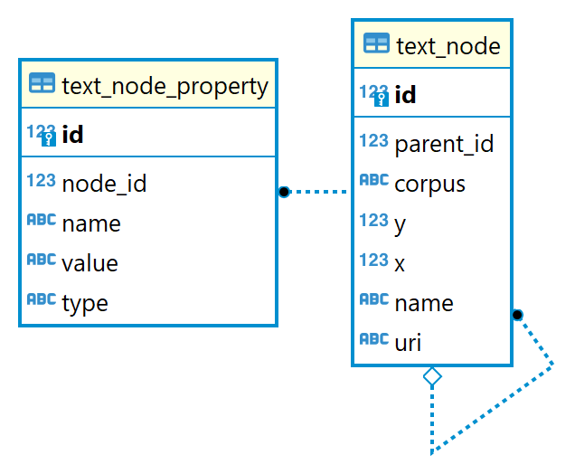

# Epigraphic Codices

This project currently contains some internal-use tools for a VeDPH research project. The scrapers found here are intended for research purposes only. Please see the copyright notices of the respective owners.

Quick Docker image build:

```bash
docker build . -t vedph2020/epicod-api:1.0.0 -t vedph2020/epicod-api:latest
```

(replace with the current version).

## Prerequisites

All what you need is a PostgreSQL service. You can use a Dockerized service like this (the sample refers to a Windows machine):

```ps1
docker run --volume postgresData://c/data/pgsql -p 5432:5432 --name postgres -e POSTGRES_PASSWORD=postgres -d postgres
```

(or use an image like `postgis/postgis` if you need GIS functionality).

## Database

A RDBMS is used as the target of scraping and parsing processes. The database schema is designed to be able to hold data from different sources and with different formats and modeling. To this end, I have designed a very simple structure to represent the hierarchical organization of each corpus (an upcoming paper will provide more details about modeling).



In fact, it's easy to realize that whatever corpus we will handle will include a set of texts in some hierarchical structure. For instance, in the case of Packhum this is the one appearing from the site: regions include books, books include texts.

As we have no clue about the structure of other corpora, nor about the metadata eventually attached to any level of it, I've designed a tree-like structure. In it, the central entity is a (tree) node. The node can correspond to a text, or just to any grouping of texts, like books, or regions. Nodes are stored in table `text_node`.

Each node can have any number of metadata, stored in table `text_node_properties` as name=value pairs. Metadata come either from context (the level of the structure being scraped) or by parsing the short information text prepended to each inscription.

This allows to easily and neutrally represent any hierarchy in the corpus being scraped.

## Corpora

- [Packhard Humanities Greek Inscriptions](./docs/packhum.md)
- [Epigraphische Datenbank Clauss](./docs/clauss.md)

More to come.

## Database Management

- <https://simplebackups.com/blog/postgresql-pgdump-and-pgrestore-guide-examples>

Quick note about database dump/restore for testers.

```ps1
pg_dump --username=postgres -f DUMPFILEPATH DBNAME
```

>Note the usage of `-f` instead of redirecting from console with `>`. This is required in *Windows* to avoid issues with encoding (see [here](https://dba.stackexchange.com/questions/281119/postgresql-pg-dump-e-encoding-option-not-working)).

- restore with [psql](https://www.postgresql.org/docs/current/app-psql.html):

```ps1
./psql -U USER -d DB_NAME -f DUMPFILEPATH
```

>The target database must be created first.

## Useful Queries

Corpora identifiers are:

- `packhum`
- `clauss`

- browsing inscriptions with their metadata for a corpus:

```sql
select tn.id, tn.name, tnp.name, tnp.value
from text_node_property tnp
inner join text_node tn on tnp.node_id = tn.id
where tn.corpus = 'packhum'
order by tn.id, tnp.name
limit 50;
```

- list of metadata types for a corpus:

```sql
select distinct tnp.name from text_node_property tnp 
inner join text_node tn on tnp.node_id = tn.id 
where tn.corpus = 'packhum'
order by name;
```

- count properties for a corpus:

```sql
select count(*) from text_node_property tnp 
inner join text_node tn on tnp.node_id = tn.id 
where tn.corpus = 'clauss';
```

- count injected properties for PHI:

```sql
select count(*) from text_node_property tnp 
inner join text_node tn on tnp.node_id = tn.id 
where tn.corpus = 'packhum' and
(tnp.name like 'date-val%' 
 or tnp.name like 'date-txt%'
 or tnp.name in ('date-phi','layout','reference','region','site','location','type','boustr','rtl','stoich-min','stoich-max','non-stoich-min','non-stoich-max','forgery'));
```

- count injected properties for Clauss:

```sql
select count(*) from text_node_property tnp 
inner join text_node tn on tnp.node_id = tn.id 
where tn.corpus = 'clauss' and
(tnp.name like 'date-val%' 
 or tnp.name like 'date-txt%'
 or tnp.name in ('languages'));
```

## History

- 2022-11-11:
  - upgraded to NET 7.
  - added boustr and rtl properties to PHI.
- 2022-11-07: Packhum and Clauss property injection.
- 2022-10-27: completed Clauss.
- 2022-10-25:
  - updated packages.
  - adding Clauss.
  - refactored tables to add property type.
- 2022-07-29: upgraded to NET 6.0.
