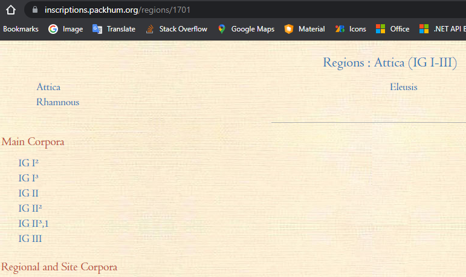
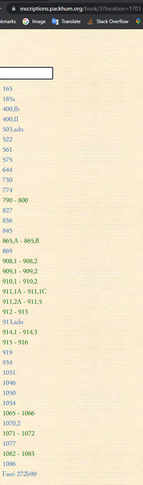
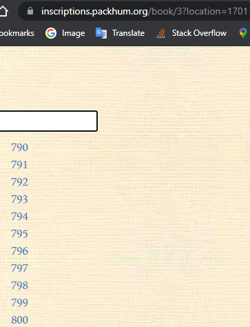

# Packard Humanities Greek Inscriptions

Plain Unicode text with Leiden conventions and minimalist metadata.

## Scraper

Root entry: <https://inscriptions.packhum.org/allregions>.

(A) level 1 (regions, static): list of regions with their target: `//table/tbody/tr/td/a`. Each target points to a relative URI `/regions/ID` where ID is a number, e.g.:

```html
<a href="/regions/1701" title="Attica Eleusis Rhamnous" class="link"
  >Attica (IG I-III)</a
>
```

(B) level 2 (region's books, static): list of books with their target: `//div[@class=\"bookclass\"]//a`. Each target points to `book/ID?location=N` where ID is a number and N is the region ID, e.g. (from <https://epigraphy.packhum.org/regions/1701>):

```html
<li class="bookrow"><a href="/book/3?location=1701" class="item">IG I²</a></li>
```

(C) level 3 (book's texts, dynamic): once JS completed, texts in the book are listed in an `ul`, each in its `li`. Most of the list items are just single texts, and thus have an anchor targeting it, like `//li[@class=\"item\"]/a`. Yet, some list items, or even all in some cases, can be of class `range item`, and rather represent a range of texts, like `<li class="range item" id="o11c11">790 - 800</li>`. A relevant issue here is that these items _do not have any anchor with a link_ to be followed. Rather, when the range items are clicked, a POST to `https://epigraphy.packhum.org/phikey` happens. For instance, for the list item sampled above the POST has a form data with `location`=1701 (Attica), `bookid`=3 (IG I2), `offset`=11, `count`=11 (`location=1701&patt=&bookid=3&offset=11&count=11`). The response is an HTML fragment, having an `ul` with `li` items for each text, as described above. This fragment replaces the page's list entirely, so that at the end you only have the items in the range, while all the others are gone. This also means that the back button in the browser cannot retrieve the original list, as the page location did not change; only part of its content was replaced. Further, the HTML fragment loaded via AJAX when clicking on a range can include not only texts, but even other ranges, with the same issues shown above.

## Strategy

The scraping strategy is thus complex for level 3.

For level 1, the list of regions is just loaded and each link to single region pages is followed.

For level 2, the list of books is loaded and each link is followed, as above.

Level 3 instead poses a number of issues, because it opens an interactive page where even the first list is dynamically loaded. Each list loaded can have a mix of text and range items. Range items have no link; we rather have to click on them thus triggering JS code which loads some HTML via AJAX.

The strategy here is:

1. the page at the specified URI is loaded.
2. all the range items are collected. Each is identified by the index of the range item in the array of range items; thus, 0=first range item, 1=second range item, etc. Please note that this index is not the index of the `li` item, as the list includes a mix of range and text items.
3. all the text items are followed and scraped.
4. for each collected range item, we click on its `li` item and let JS load a new list. Then, the procedure at 2-4 is recursively followed for the newly loaded list. Notice that whenever a new range item needs to be processed, we first have to re-load the starting list. We cannot just navigate back, because this would move away from the region page altogether. This is because lists are dynamically loaded via AJAX and thus do not affect browser's history. From the point of view of the browser, we always are in the same page; it's only that its content gets updated by JS when we click on a range item. So, here we need to navigate to the original list by repeating the whole walking process, from the original page as loaded the first time. Once this is loaded again, we continue clicking on range items and get the corresponding list loaded, until we are back to the list corresponding to our current loop. Then we can proceed with clicking the next range item. So, not only this is a recursive process (because of the nesting of range items within other range items); but we also need to re-play the full sequence of clicks which lead to the list we're processing, each triggering the load of a new list.

While scraping, the tree hierarchy of each page is reflected in the target data model, where each page or text corresponds to a node. Each node has Y and X coordinates representing its depth level and sibling number, plus a label got from the page or text.

## Reading Scraper's Log

The scraper saves a full log of its work under the program's directory. There is a log file for each day, named `epicod` plus the date and extension `txt`.

In order to better explain the scraping strategy, and let team members check the process, let's look at the first entries of a sample log. I removed date and time of each entry and some less relevant details to improve its readability.

(1) At first, the root page is loaded, with the list of all the regions (level A). The first region to be followed is Attica. Its node is logged as `[packhum#1]`, i.e. the first node of `packhum` corpus. The `P` section in the entry introduces additional node's properties (metadata), which for non-text nodes are not present (whence `P: -`).

Then (level B), the page for Attica is loaded. There, the first entry found is book `IG I²`, which in turn will be another node, child of the Attica region node.

```txt
[INF] [A] Regions at https://inscriptions.packhum.org/allregions
[INF] [packhum#1] @1.1 Attica (IG I-III) | P: -
[INF] [B] Books at https://inscriptions.packhum.org/regions/1701
[INF] [packhum#2] @2.1 IG I² | P: -
```

Here is a screenshot of the first entries in the Attica region's page:



(2) Opening the link for IG I² starts by loading the texts level (C). Once the page is loaded, the script in it triggers the loading of a first (default) list. The `path` indication after the page's URL refers to the relative path followed to walk the tree of range items. Thus, it starts as `/`, i.e. with the root path corresponding to the base page list for the requested region.

Once the page is loaded, its content is inspected. Here, we found 26 text items.

```txt
[INF] [C] Texts at https://inscriptions.packhum.org/book/3?location=1701: path /
[INF] Loading page from https://inscriptions.packhum.org/book/3?location=1701
[INF] Text items: 26
```

The screenshot here shows the first list, where range items are green, and text items are just "regular" blue links:



We first follow each of the text items, scraping it into a node. Its metadata properties names are listed in the log. Nodes are all at level 3, and range from 1 to 26 for entries `165` to `Fasti272b90`.

```txt
[INF] [packhum#3] @3.1 165 | P: -
[INF] [packhum#4] @3.1 IG I² 165 - PHI Greek Inscriptions | P: text, note, region, location, date-txt, date-val, date-phi, reference, phi
[INF] [packhum#5] @3.2 185a | P: -
[INF] [packhum#6] @3.2 IG I² 185a - PHI Greek Inscriptions | P: text, note, region, location, reference, reference, phi
[INF] [packhum#7] @3.3 400,Ib | P: -
[INF] [packhum#8] @3.3 IG I² 400,Ib - PHI Greek Inscriptions | P: text, note, region, location, date-nan, date-phi, reference, phi
[INF] [packhum#9] @3.4 400,II | P: -
[INF] [packhum#10] @3.4 IG I² 400,II - PHI Greek Inscriptions | P: text, note, region, location, date-nan, date-phi, reference, phi
[INF] [packhum#11] @3.5 503,adn | P: -
[INF] [packhum#12] @3.5 IG I² 503,adn - PHI Greek Inscriptions | P: text, note, region, location, type, date-txt, date-val, date-phi, reference, phi
[INF] [packhum#13] @3.6 522 | P: -
[INF] [packhum#14] @3.6 IG I² 522 - PHI Greek Inscriptions | P: text, note, region, location, type, reference, reference, phi
[INF] [packhum#15] @3.7 561 | P: -
[INF] [packhum#16] @3.7 IG I² 561 - PHI Greek Inscriptions | P: text, note, region, location, layout, date-txt, date-val, date-phi, reference, phi
[INF] [packhum#17] @3.8 575 | P: -
[INF] [packhum#18] @3.8 IG I² 575 - PHI Greek Inscriptions | P: text, note, region, location, date-nan, date-phi, reference, phi
[INF] [packhum#19] @3.9 644 | P: -
[INF] [packhum#20] @3.9 IG I² 644 - PHI Greek Inscriptions | P: text, note, region, location, type, reference, phi
[INF] [packhum#21] @3.10 730 | P: -
[INF] [packhum#22] @3.10 IG I² 730 - PHI Greek Inscriptions | P: text, note, region, location, type, reference, phi
[INF] [packhum#23] @3.11 774 | P: -
[INF] [packhum#24] @3.11 IG I² 774 - PHI Greek Inscriptions | P: text, note, region, location, layout, date-txt, date-val, date-phi, reference, phi
[INF] [packhum#25] @3.12 827 | P: -
[INF] [packhum#26] @3.12 IG I² 827 - PHI Greek Inscriptions | P: text, note, region, location, type, date-txt, date-val, date-phi, reference, phi
[INF] [packhum#27] @3.13 836 | P: -
[INF] [packhum#28] @3.13 IG I² 836 - PHI Greek Inscriptions | P: text, note, region, location, type, phi
[INF] [packhum#29] @3.14 845 | P: -
[INF] [packhum#30] @3.14 IG I² 845 - PHI Greek Inscriptions | P: text, note, region, location, date-txt, date-val, date-phi, reference, phi
[INF] [packhum#31] @3.15 869 | P: -
[INF] [packhum#32] @3.15 IG I² 869 - PHI Greek Inscriptions | P: text, note, region, location, date-txt, date-val, date-phi, reference, phi
[INF] [packhum#33] @3.16 913,adn | P: -
[INF] [packhum#34] @3.16 IG I² 913,adn - PHI Greek Inscriptions | P: text, note, region, location, type, reference, phi
[INF] [packhum#35] @3.17 919 | P: -
[INF] [packhum#36] @3.17 IG I² 919 - PHI Greek Inscriptions | P: text, note, region, location, type, date-txt, date-val, date-phi, reference, phi
[INF] [packhum#37] @3.18 934 | P: -
[INF] [packhum#38] @3.18 IG I² 934 - PHI Greek Inscriptions | P: text, note, region, location, date-txt, date-val, date-phi, reference, phi
[INF] [packhum#39] @3.19 1031 | P: -
[INF] [packhum#40] @3.19 IG I² 1031 - PHI Greek Inscriptions | P: text, note, region, location, date-txt, date-val, date-phi, reference, phi
[INF] [packhum#41] @3.20 1046 | P: -
[INF] [packhum#42] @3.20 IG I² 1046 - PHI Greek Inscriptions | P: text, note, region, location, date-txt, date-val, date-phi, reference, phi
[INF] [packhum#43] @3.21 1050 | P: -
[INF] [packhum#44] @3.21 IG I² 1050 - PHI Greek Inscriptions | P: text, note, region, location, reference, reference, reference, phi
[INF] [packhum#45] @3.22 1054 | P: -
[INF] [packhum#46] @3.22 IG I² 1054 - PHI Greek Inscriptions | P: text, note, region, location, date-txt, date-val, date-phi, reference, phi
[INF] [packhum#47] @3.23 1070,2 | P: -
[INF] [packhum#48] @3.23 IG I² 1070,2 - PHI Greek Inscriptions | P: text, note, region, location, date-txt, date-val, date-phi, reference, phi
[INF] [packhum#49] @3.24 1077 | P: -
[INF] [packhum#50] @3.24 IG I² 1077 - PHI Greek Inscriptions | P: text, note, region, location, date-txt, date-val, date-phi, reference, phi
[INF] [packhum#51] @3.25 1086 | P: -
[INF] [packhum#52] @3.25 IG I² 1086 - PHI Greek Inscriptions | P: text, note, region, location, type, date-txt, date-val, date-phi, phi
[INF] [packhum#53] @3.26 Fasti 272b90 | P: -
[INF] [packhum#54] @3.26 IG I² Fasti 272b90 - PHI Greek Inscriptions | P: text, note, region, location, date-txt, date-val, date-phi, reference, phi
```

Then we have to follow the green range items. There are 13 of them; we thus start looping range items from 1 to 13. The first cycle in the loop is for range item 1 of 13, whose label is `790 - 800`. You can now see that the relative `path` is `/0` because we have walked down from the "root" list (`/`) to the list loaded from the 1st range, whose index is 0; thus, path is `/0` = 1st child range item in the source list.

Once we "click" on the range item, a new list replaces the existing one in our current page. This list then gets scraped. There are 11 text items here, and no range item.

```txt
[INF] Ranges to follow: 13
[INF] Range 1/13: 0: "790 - 800"
[INF] [C] Texts at https://inscriptions.packhum.org/book/3?location=1701*: path /0
[INF] Text items: 11
[INF] [packhum#55] @3.1 790 | P: -
[INF] [packhum#56] @3.1 IG I² 790 - PHI Greek Inscriptions | P: text, note, region, location, type, reference, phi
[INF] [packhum#57] @3.2 791 | P: -
[INF] [packhum#58] @3.2 IG I² 791 - PHI Greek Inscriptions | P: text, note, region, location, type, reference, phi
[INF] [packhum#59] @3.3 792 | P: -
[INF] [packhum#60] @3.3 IG I² 792 - PHI Greek Inscriptions | P: text, note, region, location, type, reference, phi
[INF] [packhum#61] @3.4 793 | P: -
[INF] [packhum#62] @3.4 IG I² 793 - PHI Greek Inscriptions | P: text, note, region, location, type, reference, phi
[INF] [packhum#63] @3.5 794 | P: -
[INF] [packhum#64] @3.5 IG I² 794 - PHI Greek Inscriptions | P: text, note, region, location, type, reference, phi
[INF] [packhum#65] @3.6 795 | P: -
[INF] [packhum#66] @3.6 IG I² 795 - PHI Greek Inscriptions | P: text, note, region, location, type, reference, phi
[INF] [packhum#67] @3.7 796 | P: -
[INF] [packhum#68] @3.7 IG I² 796 - PHI Greek Inscriptions | P: text, note, region, location, type, reference, phi
[INF] [packhum#69] @3.8 797 | P: -
[INF] [packhum#70] @3.8 IG I² 797 - PHI Greek Inscriptions | P: text, note, region, location, type, reference, phi
[INF] [packhum#71] @3.9 798 | P: -
[INF] [packhum#72] @3.9 IG I² 798 - PHI Greek Inscriptions | P: text, note, region, location, type, reference, phi
[INF] [packhum#73] @3.10 799 | P: -
[INF] [packhum#74] @3.10 IG I² 799 - PHI Greek Inscriptions | P: text, note, region, location, type, reference, phi
[INF] [packhum#75] @3.11 800 | P: -
[INF] [packhum#76] @3.11 IG I² 800 - PHI Greek Inscriptions | P: text, note, region, location, type, reference, phi
```

Here is the corresponding screenshot:



Note that _this is the same page of the preceding list_. The JS code in the page has replaced the list with another one. So, should you navigate to this page with your browser and then click the back button, you will not get back to the previous list, but rather to the previous page, with no texts list at all.

Here we are lucky enough that there is no range item; so once we have finished scraping the text items, we can go back to the source list. As we have just remembered, we can't simply "go back". We need to restart from the Attica's books list re-loading it, and then click the 1st range item to get back to the list we are processing. These are the corresponding entries in the log:

```txt
[INF] Repositioning to / starting from https://inscriptions.packhum.org/book/3?location=1701
[INF] Loading page from https://inscriptions.packhum.org/book/3?location=1701
[INF] Repositioning completed
```

We can now keep looping through the range items of our list. We thus move to the 2nd range item (`865,A - 865,B`) by clicking on it, which triggers the update of the list. Note that now the path reads `/1` because we are processing the 2nd child range item (whose zero-based index is 1).

This list happens to have only 2 text items, which get followed. The corresponding nodes are saved.

```txt
[INF] Range 2/13: 1: "865,A - 865,B"
[INF] [C] Texts at https://inscriptions.packhum.org/book/3?location=1701*: path /1
[INF] Text items: 2
[INF] [packhum#77] @3.1 865,A | P: -
[INF] [packhum#78] @3.1 IG I² 865,A - PHI Greek Inscriptions | P: text, note, region, location, date-txt, date-val, date-phi, reference, phi
[INF] [packhum#79] @3.2 865,B | P: -
[INF] [packhum#80] @3.2 IG I² 865,B - PHI Greek Inscriptions | P: text, note, region, location, date-txt, date-val, date-phi, reference, phi
```

Again, no range items here. So we need to re-load the "root" list, and then click until we get back to our source list. Once this is done, we click the 3rd range item, and follow its text items, as above.

```txt
[INF] Repositioning to / starting from https://inscriptions.packhum.org/book/3?location=1701
[INF] Loading page from https://inscriptions.packhum.org/book/3?location=1701
[INF] Repositioning completed
[INF] Range 3/13: 2: "908,1 - 908,2"
[INF] Loaded page hash: 332857183
[INF] [C] Texts at https://inscriptions.packhum.org/book/3?location=1701*: path /2
[INF] Text items: 2
[INF] [packhum#81] @3.1 908,1 | P: -
[INF] [packhum#82] @3.1 IG I² 908,1 - PHI Greek Inscriptions | P: text, note, region, location, type, date-txt, date-val, date-phi, reference, reference, phi
[INF] [packhum#83] @3.2 908,2 | P: -
[INF] [packhum#84] @3.2 IG I² 908,2 - PHI Greek Inscriptions | P: text, note, region, location, type, date-txt, date-val, date-phi, reference, reference, phi
```

The process then continues recursively, until all the range items have been followed. Once this happens, we will move to the next book; once all the books are done, we will move on the next region; and once all the regions are done, we have finished.

If you now look at the target database, you will see nodes in the `text_node` table, e.g.:

|id|parent_id|corpus|y|x|name|uri|
|--|---------|------|-|-|----|---|
|1|0|packhum|1|1|Attica (IG I-III)|<https://inscriptions.packhum.org/regions/1701>|
|2|1|packhum|2|1|IG I²|<https://inscriptions.packhum.org/book/3?location=1701>|
|76|1|packhum|2|2|IG I³|<https://inscriptions.packhum.org/book/4?location=1701>|
|3|2|packhum|3|1|IG I² 165 - PHI Greek Inscriptions|<https://inscriptions.packhum.org/text/1754?&amp;bookid=3&amp;location=1701>|
|4|2|packhum|3|2|IG I² 185a - PHI Greek Inscriptions|<https://inscriptions.packhum.org/text/1755?&amp;bookid=3&amp;location=1701>|
|5|2|packhum|3|3|IG I² 400,Ib - PHI Greek Inscriptions|<https://inscriptions.packhum.org/text/1756?&amp;bookid=3&amp;location=1701>|
|6|2|packhum|3|4|IG I² 400,II - PHI Greek Inscriptions|<https://inscriptions.packhum.org/text/1757?&amp;bookid=3&amp;location=1701>|
|7|2|packhum|3|5|IG I² 503,adn - PHI Greek Inscriptions|<https://inscriptions.packhum.org/text/1758?&amp;bookid=3&amp;location=1701>|
|8|2|packhum|3|6|IG I² 522 - PHI Greek Inscriptions|<https://inscriptions.packhum.org/text/1759?&amp;bookid=3&amp;location=1701>|
|9|2|packhum|3|7|IG I² 561 - PHI Greek Inscriptions|<https://inscriptions.packhum.org/text/1760?&amp;bookid=3&amp;location=1701>|
|10|2|packhum|3|8|IG I² 575 - PHI Greek Inscriptions|<https://inscriptions.packhum.org/text/1761?&amp;bookid=3&amp;location=1701>|

Here (numbers refer to Y and X; query is `select * from text_node order by y,parent_id,x;`):

- (1.1) the root node for `Attica (IG I-III)` is the one with `parent_id`=0.
- (2.1-2.2) its direct children are books `IG I²` and `IG I³`.
- (3.1-3.8) the first children of book `IG I²` are inscriptions 165-575.

## Text

In the end, each text will be found in its own page, having a line for each table row: `table[@class="grk"]/tbody/tr`. In the table, each `tbody/tr` has 2 `td`, the first either empty or with numbering, the second with text. Also, metadata are:

- `span[@class="ti"]` with text information.
- a final `div[@class="docref"]` contains `a` with href whose value is the PHI ID like `PHI1754`.

The note at the top of each text page is a line with U+2014 as separator, including these data (the asterisk marks those data which seem to be always present):

1. region\*
2. location\*
3. type
4. date\*
5. reference(s)

For instance:

```txt
Att. — Athens: Akropolis — stoich. 28 — 440-410 a. — IG I² 87,f + 141,a, + 174 — IG I³, Add.p.950
```

Unfortunately, the only constant field seems to be the region; so it's difficult to detect which field is what. For instance:

```txt
Att. — 440-430 a.
Att. — Lamptrai: Thiti — s. V a. — Elliot(1962) 56-58 (+) — SEG 32.19
```

Going deeper, we can observe that:

- type usually is a word in `[]` (e.g. `[pottery]`), or is related to the writing direction or layout (e.g. `stoich.` with an optional letters count, `non-stoich.`, `boustr.`, `retrogr.`).
- date has a number of forms: I quote an example for each observed pattern:
  - 2nd ac
  - c. 2nd ac
  - s. V a.
  - s. VI/V a.
  - med. s. V a.
  - fin. s. V a.
  - fin. s. VI/init. s. V a.
  - 4th c. BC
  - 427 a.
  - 525-500? BC
  - c. 480? a.
  - c. 380-370 BC
  - c. 425-400? a.
  - ante 450 a.
  - post 427 a.
  - early imp.
  - aet. Hadriani

Of course this parsing is not fully refined, but is designed to be successful in most cases, because this is enough for this project, based on large numbers.
